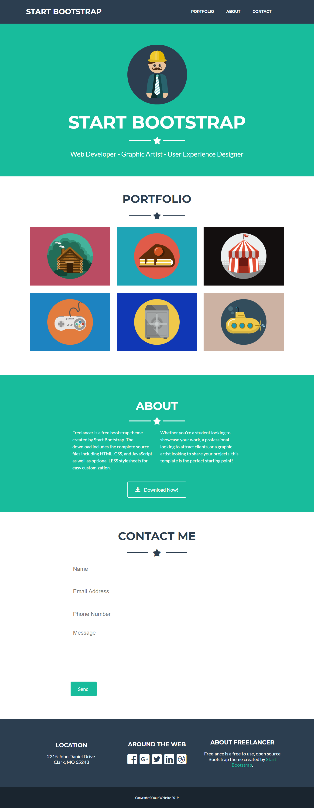

# Freelancer

* **Track:** _Common Core_
* **Curso:** _Criando um site interativo_
* **Unidad:** _Layout da Web com HTML & CSS_

***

## Objetivo

O desafio consiste em replicar o site **Freelancer**, a fim de que o layout html e css do site filho seja o mais próximo possível do site pai.

Para completar este desafio, criamos um repositório boilerplate (template inicial) com todos os recursos necessários. Isso inclui imagens, estrutura de pastas e arquivos onde você irá escrever seu código.

## Resultado

 tendo como resultado desejado este:

E o resultado final é este:

Foram utilizadas classes para customização do css e flexbox para posicionamento da maioria dos elementos na tela.

## Considerações

* Os ícones das redes sociais utilizados foram diferentes, porém são os das mesmas redes visualizadas no site original.

* Visite este endereço para conferir o [site original](https://blackrockdigital.github.io/startbootstrap-freelancer/).

* No site original há certos efeitos e funcionalidades que estão fora do alcance desse desafio.

